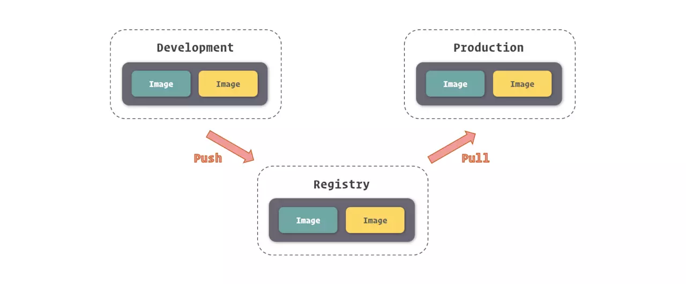
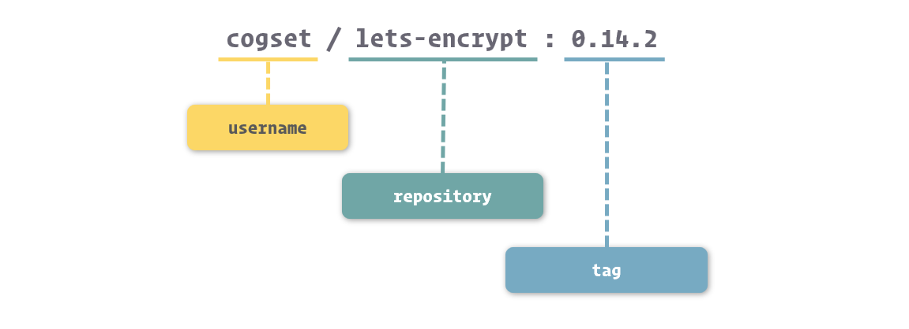

# 前端应该知道的 Docker 基础知识

## Docker 简介

### 什么是 Docker

Docker 是一个能够允许用户轻松在容器内打包，分发和管理应用程序的平台。简单理解，就是一个性能更好、资源利用率低、能快速部署的虚拟机。

### 为什么需要 Docker，Docker 解决了什么问题

#### 从应用架构角度理解Docker

从应用架构角度理解Docker刚开始，你只需要写一个Node.js程序，挂载一个静态网站；然后，你做了一个用户账号系统，这时需要数据库了，比如说MySQL; 后来，为了提升性能，你引入了Memcached缓存；终于有一天，你决定把前后端分离，这样可以提高开发效率；当用户越来越多，你又不得不使用Nginx做反向代理; 对了，随着功能越来越多，你的应用依赖也会越来越多…总之，你的应用架构只会越来越复杂。不同的组件的安装，配置与运行步骤各不相同，于是你不得不写一个很长的文档给新同事，只为了让他搭建一个开发环境。使用Docker的话，你可以为不同的组件逐一编写Dockerfile，分别构建镜像，然后运行在各个容器中。

这样做，将复杂的架构统一了，所有组件的安装和运行步骤统一为几个简单的命令:

- 构建Docker镜像: `docker build`
- 上传Docker镜像: `docker push`
- 下载Docker镜像: `docker pull`
- 运行Docker容器: `docker run`

#### 从应用部署角度理解Docker

开发、构建、测试、生产将全部在Docker容器中执行，你需要为不同步骤编写不同的Dockerfile。当依赖变化时，仅需要稍微修改Dockerfile即可。结合构建工具Jenkins，就可以将整个部署流程自动化。另一方面，Dockerfile将Docker镜像描述得非常精准，能够保证很强的一致性。比如，操作系统的版本，Node.js的版本，NPM模块的版本等。这就意味着，在本地开发环境运行成功的镜像，在构建、测试、生产环境中也没有问题。还有，不同的Docker容器是依赖于不同的Docker镜像，这样他们互不干扰。比如，两个Node.js应用可以分别使用不同版本的Node.js。

#### 从集群管理角度理解

Docker架构规模越来越大的时候，你有必要引入集群了。这就意味着，服务器由1台变成了多台，同一个应用需要运行多个备份来分担负载。当然，你可以手动对集群的功能进行划分: Nginx服务器，Node.js服务器，MySQL服务器，测试服务器，生产服务器…这样做的好处是简单粗暴；也可以说财大气粗，因为资源闲置会非常严重。还有一点，每次新增节点的时候，你就不得不花大量时间进行安装与配置，这其实是一种低效的重复劳动。下载Docker镜像之后，Docker容器可以运行在集群的任何一个节点。一方面，各个组件可以共享主机，且互不干扰；另一方面，也不需要在集群的节点上安装和配置任何组件

## 安装 Docker

### 安装方式

- [docker-ce linux setup](https://docs.docker.com/install/linux/docker-ce/ubuntu/)
- [docker-for-mac](https://docs.docker.com/docker-for-mac/install/)
- [docker-for-windows](https://docs.docker.com/docker-for-windows/install/)

### 查看当前 docker 信息

- `docker info`
- `docker version`

### 设置 registry

#### linux

修改 `/etc/docker/daemon.json

```json
{
    "registry-mirrors": [
        "https://registry.docker-cn.com"
    ]
}
```

```shell
  systemctl restart docker
```

#### Mac

- Preference -> daemon

## Docker 的核心组成

在 Docker 体系里，有四个对象 ( Object ) 是我们不得不进行介绍的，因为几乎所有 Docker 以及周边生态的功能，都是围绕着它们所展开的。它们分别是：**镜像 ( Image )**、**容器 ( Container )**、**网络 ( Network )**、**数据卷 ( Volume )**。

## 镜像

如果进行形象的表述，我们可以将 Docker 镜像理解为包含应用程序以及其相关依赖的一个基础文件系统，在 Docker 容器启动的过程中，它以只读的方式被用于创建容器的运行环境。我们也可以简单把镜像看作是编程中的类，容器是基于类的实例化。

从另一个角度看，Docker 镜像其实是由基于 UnionFS 文件系统的一组镜像层依次挂载而得，而每个镜像层包含的其实是对上一镜像层的修改，这些修改其实是发生在容器运行的过程中的。所以，我们也可以反过来理解，镜像是对容器运行环境进行持久化存储的结果。

另外，由于这种结构，Docker 的镜像实质上是无法被修改的，因为所有对镜像的修改只会产生新的镜像，而不是更新原有的镜像。

每次对镜像内容的修改，Docker 都会将这些修改铸造成一个镜像层，而一个镜像其实就是由其下层所有的镜像层所组成的。当然，每一个镜像层单独拿出来，与它之下的镜像层都可以组成一个镜像。

对于每一个记录文件系统修改的镜像层来说，Docker 都会根据它们的信息生成了一个 Hash 码，这是一个 64 长度的字符串，足以保证唯一性。这就像我们使用 git ，每一次对镜像内容的修改，就像是进行了一次 git commit 。

### 镜像仓库

如果说我们把镜像的结构用 Git 项目的结构做类比，那么镜像仓库就可以看似 GitLab、GitHub 等的托管平台，只不过 Docker 的镜像仓库托管的不是代码项目，而是镜像。

借助镜像仓库，我们得到了一个镜像的中转站，我们可以将开发环境上所使用的镜像推送至镜像仓库，并在测试或生产环境上拉取到它们，而这个过程仅需要几个命令，甚至自动化完成。



### 获取镜像

```shell
  docker pull ubuntu
```

下载进度会分为几行，其实每一行代表的就是一个镜像层。Docker 首先会拉取镜像所基于的所有镜像层，之后再单独拉取每一个镜像层并组合成这个镜像。当然，如果在本地已经存在相同的镜像层 ( 共享于其他的镜像 )，那么 Docker 就直接略过这个镜像层的拉取而直接采用本地的内容。

使用 tag 拉取指定版本的镜像:

```shell
  docker pull ubuntu:16.04
```

#### 镜像的命名

镜像层的 ID 既可以识别每个镜像层，也可以用来直接识别镜像 ( 因为根据最上层镜像能够找出所有依赖的下层镜像，所以最上层进行的镜像层 ID 就能表示镜像的 ID )，但是使用这种无意义的超长哈希码显然是违背人性的。



- username： 主要用于识别上传镜像的不同用户，与 GitHub 中的用户空间类似。
- repository：主要用于识别镜像的内容，形成对镜像的表意描述。
- tag：主要用户表示镜像的版本，方便区分进行内容的不同细节。

对于 username 来说，在上面我们展示的 `docker images` 结果中，有的镜像有 username 这个部分，而有的镜像是没有的。没有 username 这个部分的镜像，表示镜像是由 Docker 官方所维护和提供的，所以就不单独标记用户了。

当我们没有提供镜像标签时，Docker 会默认使用 latest 这个标签。

### Docker Hub

[Docker Hub](https://hub.docker.com/) 中央镜像仓库系统，同时也是 Docker Engine 的默认镜像仓库，常用服务软件的镜像，我们都能在 Docker Hub 中找到，甚至能找到针对它们不同用法的不同镜像，同时，Docker Hub 也允许我们将我们制作好的镜像上传到其中。

### 搜索镜像

- [Docker Hub 上进行搜索](https://hub.docker.com/search?q=&type=image)
- 使用 `docker search` 命令

  ```shell
    docker search node
  ```

  也可以只搜索官方版本

  ```shell
     docker search --filter=is-official=true node
  ```

### 管理镜像

- 列出本地所有镜像 `docker images`
- 在 docker inspect 的结果中我们可以看到关于镜像相当完备的信息，还能查看容器等之前我们所提到的 Docker 对象的信息，而传参的方式除了传递镜像或容器的名称外，还可以传入镜像 ID 或容器 ID。

  ```shell
    $ sudo docker inspect redis:4.0
    $ sudo docker inspect 2fef532e
  ```

- 删除镜像 `docker rmi`
  - 参数是镜像的名称或 ID
    - `docker rmi ubuntu:latest`
  - 删除镜像的过程其实是删除镜像内的镜像层，在删除镜像命令打印的结果里，我们可以看到被删除的镜像层以及它们的 ID。当然，如果存在两个镜像共用一个镜像层的情况，你也不需要担心 Docker 会删除被共享的那部分镜像层，只有当镜像层只被当前被删除的镜像所引用时，Docker 才会将它们从硬盘空间中移除。
  - 支持批量删除

    ```shell
      docker rmi redis:3.2 redis:4.0
    ```

## 容器

### 创建容器

当我们选择好镜像以后，就可以通过 `docker create` 这个命令来创建容器。

```shell
  docker create nginx
  fd57f30807949ff90d7d9d9a50f09e80f463e434d3988b82dace866a6c134627
```

执行 docker create 后，Docker 会根据我们所给出的镜像创建容器，在控制台中会打印出 Docker 为容器所分配的容器 ID，此时容器是处于 Created 状态的。

我们可以通过 `--name` 这个选项来配置容器名。

```shell
  docker create --name chenxiaojun nginx
  fd57f30807949ff90d7d9d9a50f09e80f463e434d3988b82dace866a6c134627
```

### 启动容器

通过 `docker create` 创建的容器，是处于 `Created` 状态的，其内部的应用程序还没有启动，所以我们需要通过 `docker start` 命令来启动它。

```shell
  docker start nginx
```

我们可以把 `docker create` 与 `docker start`通过 `docker start` 合并成一步：

```shell
  docker run --name chenxiaojun -d nginx
  89f2b769498a50f5c35a314ab82300ce9945cbb69da9cda4b022646125db8ca7
```

其中`-d`等同于`--detach`，后台运行。

### 管理容器

- 通过 `docker ps` 这个命令，我们可以罗列出 Docker 中的容器。
- 默认情况下，`docker ps` 列出的容器是处于运行中的容器，如果要列出所有状态的容器，需要增加 `-a` 或 `--all` 选项。
- `docker ps` 结果中的 `COMMAND` 表示的是容器中主程序的启动命令，这条命令是在镜像内定义的，而容器的启动其实质就是启动这条命令。

- 要将正在运行的容器停止，我们可以使用 docker stop 命令。

  ```shell
    docker stop nginx
  ```

- 容器停止后，其维持的文件系统沙盒环境还是存在的，内部被修改的内容也都会保留，我们可以通过 `docker start` 命令将这个容器再次启动。

- 当我们需要完全删除容器时，可以通过 docker rm 命令将容器进行删除。

  ```shell
  docker rm nginx
  ```

- 正在运行中的容器默认情况下是不能被删除的，我们可以通过增加 -f 或 --force 选项来让 docker rm 强制停止并删除容器。

- 清除已停止的容器 `docker container prune`

### 进入容器

容器是一个隔离运行环境的东西，它里面除了镜像所规定的主进程外，其他的进程也是能够运行的，Docker 为我们提供了一个命令 docker exec 来让容器运行我们所给出的命令。

```shell
  docker exec nginx ls /etc
```

进入容器内部的终端

```shell
  docker exec -it nginx bash
```

其中 `-i ( --interactive )` 表示保持我们的输入流，只有使用它才能保证控制台程序能够正确识别我们的命令。而 `-t ( --tty )` 表示启用一个伪终端，形成我们与 bash 的交互，如果没有它，我们无法看到 bash 内部的执行结果。

### 衔接到容器

Docker 为我们提供了一个 docker attach 命令，用于将当前的输入输出流连接到指定的容器上。

```shell
  docker attach nginx
```

这个命令最直观的效果可以理解为我们将容器中的主程序转为了“前台”运行 ( 与 docker run 中的 -d 选项有相反的意思 )。

由于我们的输入输出流衔接到了容器的主程序上，我们的输入输出操作也就直接针对了这个程序，而我们发送的 Linux 信号也会转移到这个程序上。例如我们可以通过 Ctrl + C 来向程序发送停止信号，让程序停止 ( 从而容器也会随之停止 )。

## 容器网络

容器网络实质上也是由 Docker 为应用程序所创造的虚拟环境的一部分，它能让应用从宿主机操作系统的网络环境中独立出来，形成容器自有的网络相关的模块。

### 容器互联

由于 Docker 提倡容器与应用共生的轻量级容器理念，所以容器中通常只包含一种应用程序，但我们知道，如今纷繁的系统服务，没有几个是可以通过单一的应用程序支撑的。拿最简单的 Web 应用为例，也至少需要业务应用、数据库应用、缓存应用等组成。也就是说，在 Docker 里我们需要通过多个容器来组成这样的系统。

要让一个容器连接到另外一个容器，我们可以在容器通过 docker create 或 docker run 创建时通过 --link 选项进行配置。

```shell
  sudo docker run -d --name mysql -e MYSQL_RANDOM_ROOT_PASSWORD=yes mysql
  sudo docker run -d --name webapp --link mysql webapp:latest
```

容器间的网络已经打通，那么我们要如何在 Web 应用中连接到 MySQL 数据库呢？Docker 为容器间连接提供了一种非常友好的方式，我们只需要将容器的网络命名填入到连接地址中，就可以访问需要连接的容器了。

假设我们在 Web 应用中使用的是 JDBC 进行数据库连接的，我们可以这么填写连接。

```shell
  String url = "jdbc:mysql://mysql:3306/webapp";
```

在这里，连接地址中的 mysql 就好似我们常见的域名解析，Docker 会将其指向 MySQL 容器的 IP 地址

#### 通过别名连接

纯粹的通过容器名来打开容器间的网络通道缺乏一定的灵活性，在 Docker 里还支持连接时使用别名来使我们摆脱容器名的限制。

```shell
  docker run -d --name webapp --link mysql:database webapp:latest
```

在这里，我们使用 `--link <name>:<alias>` 的形式，连接到 MySQL 容器，并设置它的别名为 database。当我们要在 Web 应用中使用 MySQL 连接时，我们就可以使用 database 来代替连接地址了。

```shell
String url = "jdbc:mysql://database:3306/webapp";
```

### 暴露端口

虽然容器间的网络打通了，但并不意味着我们可以任意访问被连接容器中的任何服务。Docker 为容器网络增加了一套安全机制，只有容器自身允许的端口，才能被其他容器所访问。

这个容器自我标记端口可被访问的过程，我们通常称为暴露端口。我们在 `docker ps` 的结果中可以看到容器暴露给其他容器访问的端口。

端口的暴露可以通过 Docker 镜像进行定义，也可以在容器创建时进行定义。在容器创建时进行定义的方法是借助 `--expose` 这个选项。

```shell
  docker run -d --name mysql -e MYSQL_RANDOM_ROOT_PASSWORD=yes --expose 13306 --expose 23306 mysql:5.7
```

### 端口映射

通过 Docker 端口映射功能，我们可以把容器的端口映射到宿主操作系统的端口上，当我们从外部访问宿主操作系统的端口时，数据请求就会自动发送给与之关联的容器端口。

```shell
  docker run -d --name nginx -p 80:80 -p 443:443 nginx
```

使用端口映射选项的格式是 `-p <ip>:<host-port>:<container-port>`，其中 ip 是宿主操作系统的监听 ip，可以用来控制监听的网卡，默认为 0.0.0.0，也就是监听所有网卡。host-port 和 container-port 分别表示映射到宿主操作系统的端口和容器的端口，这两者是可以不一样的，我们可以将容器的 80 端口映射到宿主操作系统的 8080 端口，传入 -p 8080:80 即可。

## 管理和存储数据

Docker 容器中的文件系统于我们来说，虽然有很多优势，但也有很多弊端，其中显著的两点就是：

- 沙盒文件系统是跟随容器生命周期所创建和移除的，数据无法直接被持久化存储。
- 由于容器隔离，我们很难从容器外部获得或操作容器内部文件中的数据。

基于底层存储实现，Docker 提供了三种适用于不同场景的文件系统挂载方式：Bind Mount、Volume 和 Tmpfs Mount。

- **Bind Mount** 能够直接将宿主操作系统中的目录和文件挂载到容器内的文件系统中，通过指定容器外的路径和容器内的路径，就可以形成挂载映射关系，在容器内外对文件的读写，都是相互可见的。

- **Volume** 也是从宿主操作系统中挂载目录到容器内，只不过这个挂载的目录由 Docker 进行管理，我们只需要指定容器内的目录，不需要关心具体挂载到了宿主操作系统中的哪里。

- **Tmpfs Mount** 支持挂载系统内存中的一部分到容器的文件系统里，不过由于内存和容器的特征，它的存储并不是持久的，其中的内容会随着容器的停止而消失。

### 挂载文件到容器

```shell
  docker run -d --name nginx -v /webapp/html:/usr/share/nginx/html nginx
```

使用 -v 或 --volume 来挂载宿主操作系统目录的形式是 `-v <host-path>:<container-path>` 或 `--volume <host-path>:<container-path>`，其中 host-path 和 container-path 分别代表宿主操作系统中的目录和容器中的目录。这里需要注意的是，为了避免混淆，Docker 这里强制定义目录时必须使用绝对路径，不能使用相对路径。

下面几种常见场景非常适合使用这种挂载方式:

- 当我们需要从宿主操作系统共享配置的时候。对于一些配置项，我们可以直接从容器外部挂载到容器中，这利于保证容器中的配置为我们所确认的值，也方便我们对配置进行监控。例如，遇到容器中时区不正确的时候，我们可以直接将操作系统的时区配置，也就是 /etc/timezone 这个文件挂载并覆盖容器中的时区配置。

- 当我们需要借助 Docker 进行开发的时候。虽然在 Docker 中，推崇直接将代码和配置打包进镜像，以便快速部署和快速重建。但这在开发过程中显然非常不方便，因为每次构建镜像需要耗费一定的时间，这些时间积少成多，就是对开发工作效率的严重浪费了。如果我们直接把代码挂载进入容器，那么我们每次对代码的修改都可以直接在容器外部进行。

#### 只读挂载

```shell
  docker run -d --name nginx -v /webapp/html:/usr/share/nginx/html:ro nginx
```

Docker 还支持以只读的方式挂载，通过只读方式挂载的目录和文件，只能被容器中的程序读取，但不接受容器中程序修改它们的请求。在挂载选项 -v 后再接上 :ro 就可以只读挂载了。

### 挂载临时文件目录

```shell
  docker run -d --name webapp --tmpfs /webapp/cache webapp:latest
```

Tmpfs Mount 是一种特殊的挂载方式，它主要利用内存来存储数据。由于内存不是持久性存储设备，所以其带给 Tmpfs Mount 的特征就是临时性挂载。由于内存的具体位置不需要我们来指定，这个选项里我们只需要传递挂载到容器内的目录即可。

常见的适应场景:

- 应用中使用到，但不需要进行持久保存的敏感数据，可以借助内存的非持久性和程序隔离性进行一定的安全保障。

- 读写速度要求较高，数据变化量大，但不需要持久保存的数据，可以借助内存的高读写速度减少操作的时间。

## 保存和共享镜像

Docker 镜像的本质是镜像层依次挂载的结果，而容器的文件系统则是在以只读方式挂载镜像后增加的一个可读可写的沙盒环境。基于这样的结构，Docker 中为我们提供了将容器中的这个可读可写的沙盒环境持久化为一个镜像层的方法。

我们能够很轻松的在 Docker 里将容器内的修改记录下来，保存为一个新的镜像。

```shell
docker pull alpine:latest
docker run -itd --name echo ubuntu:latest /bin/bash
docker commit -m "add echo" echo
docker tag 7619d5f5ca83 echo:latest

# docker commit -m "add echo" echo echo:1.0
```

### 镜像导出

```shell
docker save -o ./echo-1.0.tar echo:1.0
```

### 镜像导入

```shell
docker load -i echo-1.0.tar
```

### 容器导入和导出

```shell
docker export -o ./echo.tar echo
docker import ./echo.tar echo:1.0
```

## 通过 Dockerfile 创建镜像

Dockerfile 是 Docker 中用于定义镜像自动化构建流程的配置文件，在 Dockerfile 中，包含了构建镜像过程中需要执行的命令和其他操作。通过 Dockerfile 我们可以更加清晰、明确的给定 Docker 镜像的制作过程，而由于其仅是简单、小体积的文件，在网络等其他介质中传递的速度极快，能够更快的帮助我们实现容器迁移和集群部署。

- Dockerfile 的体积远小于镜像包，更容易进行快速迁移和部署。
- 环境构建流程记录了 Dockerfile 中，能够直观的看到镜像构建的顺序和逻辑。
- 使用 Dockerfile 来构建镜像能够更轻松的实现自动部署等自动化流程。
- 在修改环境搭建细节时，修改 Dockerfile 文件要比从新提交镜像来的轻松、简单。

在一个完整的开发、测试、部署过程中，程序运行环境的常见 Dockerfile 指令定义通常是由开发人员来进行的，因为他们更加熟悉程序运转的各个细节，更适合搭建适合程序的运行环境。

在这样的前提下，为了方便测试和运维搭建相同的程序运行环境，常用的做法是由开发人员编写一套环境搭建手册，帮助测试人员和运维人员了解环境搭建的流程。

而 Dockerfile 就很像这样一个环境搭建手册，因为其中包含的就是一个构建容器的过程。

而比环境搭建手册更好的是，Dockerfile 在容器体系下能够完成自动构建，既不需要测试和运维人员深入理解环境中各个软件的具体细节，也不需要人工执行每一个搭建流程。

Dockerfile 的内容很简单，主要以两种形式呈现，一种是注释行，另一种是指令行。

```Dockerfile
# Comment
INSTRUCTION arguments
```

### 常见 Dockerfile 指令

```shell
  FROM docker-inter.kezaihui.com/inf/common/py_npm:latest

  ARG env

  WORKDIR /home/zaihui/atlas
  COPY ./requirements.txt .
  COPY deploy/uwsgi/${env} .

  RUN pip install -r requirements.txt -i https://nexus-inter.zaihui.com.cn/repository/zaihui-pypi/simple/ --trusted-host nexus-inter.zaihui.com.cn --extra-index-url https://pypi.doubanio.com/simple
  COPY sso/mama_cas/templates/atlas ./sso/mama_cas/templates/atlas
  RUN cd sso/mama_cas/templates/atlas && yarn install && yarn ci:build

  COPY sso ./sso

  WORKDIR /home/zaihui/atlas/sso/
  RUN python manage.py collectstatic

  ENTRYPOINT uwsgi --ini /home/zaihui/atlas/uwsgi.ini --check-static /home/zaihui/atlas

```

#### WORKDIR

[demo](workdir)

Dockerfile 中的 WORKDIR 指令用于指定容器的一个目录，容器启动时执行的命令会在该目录下执行。

```dockerfile
FROM ubuntu

RUN mkdir /mydir /myimage && echo hello 陈晓俊 > /mydir/test.txt && echo hello 周敏俊 > /myimage/test.txt

WORKDIR /mydir

CMD ["more" ,"test.txt"]
```

```shell
docker build -t chenxiaojun-workdir:latest .
docker run --name chenxiaojun chenxiaojun
```

假设容器里有一个 myimage 文件夹，我们可以在 `-w` 覆盖。

```shell
docker run --name zhouminjun chenxiaojun-workdir:latest
```

我们也可以覆盖 CMD:

```shell
docker run --name write-cmd chenxiaojun-workdir:latest ls /
```

#### FROM

Dockerfile 里，第一条指令必须是 `FROM`

`FROM` 指令指定一个基础镜像，接下来所有的指令都是基于这个镜像所展开的。在镜像构建的过程中，Docker 也会先获取到这个给出的基础镜像，再从这个镜像上进行构建操作。

#### RUN

在 RUN 指令之后，我们直接拼接上需要执行的命令，在构建时，Docker 就会执行这些命令，并将它们对文件系统的修改记录下来，形成镜像的变化。

```shell
RUN <command>
RUN ["executable", "param1", "param2"]
```

RUN 指令是支持 \ 换行的，如果单行的长度过长，建议对内容进行切割，方便阅读。

```shell
# 添加时区, 避免部分包如 aliyun-oss 因时区差异导致的签名失败问题（海外Region）
RUN apk --update add tzdata \
    && cp /usr/share/zoneinfo/Asia/Shanghai /etc/localtime \
    && echo "Asia/Shanghai" > /etc/timezone \
    && apk del tzdata
```

#### ENTRYPOINT 和 CMD

[demo](./entrypoint)

基于镜像启动的容器，在容器启动时会根据镜像所定义的一条命令来启动容器中进程号为 1 的进程。而这个命令的定义，就是通过 Dockerfile 中的 ENTRYPOINT 和 CMD 实现的。

```shell
ENTRYPOINT ["executable", "param1", "param2"]
ENTRYPOINT command param1 param2

CMD ["executable","param1","param2"]
CMD ["param1","param2"]
CMD command param1 param2
```

ENTRYPOINT 指令和 CMD 指令的用法近似，都是给出需要执行的命令，并且它们都可以为空，或者说是不在 Dockerfile 里指出。

两个指令的区别在于，ENTRYPOINT 指令的优先级高于 CMD 指令。当 ENTRYPOINT 和 CMD 同时在镜像中被指定时，CMD 里的内容会作为 ENTRYPOINT 的参数。

当 ENTRYPOINT 与 CMD 同时给出时，两者拼接之后，才是最终执行的命令。CMD 中的内容会作为 ENTRYPOINT 定义命令的参数，最终执行容器启动的还是 ENTRYPOINT 中给出的命令。

```dockerfile
  FROM ubuntu
  CMD ["p in cmd"]
  ENTRYPOINT ["echo"]
```

既然两者都是用来定义容器启动命令的，为什么还要分成两个，合并为一个指令岂不是更方便吗？

ENTRYPOINT 指令主要用于对容器进行一些初始化，而 CMD 指令则用于真正定义容器中主程序的启动命令。

另外，我们之前谈到创建容器时可以改写容器主程序的启动命令，而这个覆盖只会覆盖 CMD 中定义的内容，而不会影响 ENTRYPOINT 中的内容。

> Note: you can override the ENTRYPOINT setting using --entrypoint, but this can only set the binary to exec (no sh -c will be used).
> `docker run --entrypoint "/bin/ls" image-name -al /root`

而且，一般 ENTRYPOINT ，会使用外部脚本。

举例：

- https://github.com/nodejs/docker-node/blob/master/docker-entrypoint.sh
- https://github.com/nodejs/docker-node/blob/master/Dockerfile-slim.template

```shell
#!/bin/sh
set -e

if [ "${1#-}" != "${1}" ] || [ -z "$(command -v "${1}")" ]; then
  set -- node "$@"
fi

exec "$@"
```

`exec "$@"`，其作用其实很简单，就是运行一个程序，而运行命令就是 ENTRYPOINT 脚本的参数。反过来，由于 ENTRYPOINT 脚本的参数就是 CMD 指令中的内容，所以实际执行的就是 CMD 里的命令。

[Docker RUN vs CMD vs ENTRYPOINT](https://goinbigdata.com/docker-run-vs-cmd-vs-entrypoint/)

#### COPY 和 ADD

对比 COPY 与 ADD，两者的区别主要在于 ADD 能够支持使用网络端的 URL 地址作为 src 源，并且在源文件被识别为压缩包时，自动进行解压，而 COPY 没有这两个能力。

#### ARG

在构建中使用变量:

```dockerfile
  FROM docker-inter.kezaihui.com/inf/common/py_npm:latest
  ARG env
  COPY deploy/uwsgi/${env} .
```

[link](https://aria2.kezaihui.com/BE/inf/atlas/blob/dev/deploy/dockerfile/DockerFile)

我们可以在构建时通过 `docker build` 的 `--build-arg` 选项来设置参数变量。

```shell
build --build-arg env=zaihuiba
```

#### ENV

[demo](env)

环境变量的使用方法与参数变量一样，也都是能够直接替换指令参数中的内容。

与参数变量只能影响构建过程不同，环境变量不仅能够影响构建，还能够影响基于此镜像创建的容器。环境变量设置的实质，其实就是定义操作系统环境变量，所以在运行的容器里，一样拥有这些变量，而容器中运行的程序也能够得到这些变量的值。

环境变量的值不是在构建指令中传入的，而是在 Dockerfile 中编写的，所以如果我们要修改环境变量的值，我们需要到 Dockerfile 修改。

由于环境变量在容器运行时依然有效，所以运行容器时我们还可以对其进行覆盖，在创建容器时使用 `-e` 或是 `--env` 选项，可以对环境变量的值进行修改或定义新的环境变量。

通过 ENV 指令和 ARG 指令所定义的参数，在使用时都是采用 $ + NAME 这种形式来占位的，所以它们之间的定义就存在冲突的可能性。对于这种场景，大家只需要记住，ENV 指令所定义的变量，永远会覆盖 ARG 所定义的变量，即使它们定时的顺序是相反的。

#### VOLUME

[demo](./volume)

```dockerfile
# json 形式的 数组
VOLUME ["/data"]

# 字符串

VOLUME /data
```

``` shell
docker exec -it container-name bash
# then
docker inspect container-name
```

## 构建镜像

```shell
docker build ./webapp
```

`docker build` 可以接收一个参数，需要特别注意的是，这个参数为一个目录路径 ( 本地路径或 URL 路径 )，而并非 Dockerfile 文件的路径。在 docker build 里，这个我们给出的目录会作为构建的环境目录，我们很多的操作都是基于这个目录进行的。

例如，在我们使用 COPY 或是 ADD 拷贝文件到构建的新镜像时，会以这个目录作为基础目录。

在默认情况下，`docker build` 也会从这个目录下寻找名为 Dockerfile 的文件，将它作为 Dockerfile 内容的来源。如果我们的 Dockerfile 文件路径不在这个目录下，或者有另外的文件名，我们可以通过 `-f` 选项单独给出 Dockerfile 文件的路径。

```shell
docker build -t webapp:latest -f ./webapp/a.Dockerfile ./webapp
```

### 构建缓存

Docker 在镜像构建的过程中，还支持一种缓存策略来提高镜像的构建速度。

由于镜像是多个指令所创建的镜像层组合而得，那么如果我们判断新编译的镜像层与已经存在的镜像层未发生变化，那么我们完全可以直接利用之前构建的结果，而不需要再执行这条构建指令，这就是镜像构建缓存的原理。

那么 Docker 是如何判断镜像层与之前的镜像间不存在变化的呢？这主要参考两个维度:

- 所基于的镜像层是否一样
- 用于生成镜像层的指令的内容是否一样。

基于这个原则，我们在条件允许的前提下，更建议将不容易发生变化的搭建过程放到 Dockerfile 的前部，充分利用构建缓存提高镜像构建的速度。另外，指令的合并也不宜过度，而是将易变和不易变的过程拆分，分别放到不同的指令里。

在另外一些时候，我们可能不希望 Docker 在构建镜像时使用构建缓存，这时我们可以通过 --no-cache 选项来禁用它。

```shell
docker build -t webapp:latest -f ./webapp/a.Dockerfile --no-cache ./webapp
```

## 使用 Docker Compose 管理容器

## next

docker 高级用法和 Kubernetes

待续...

---

- https://www.zhihu.com/question/22871084/answer/635699901
- https://yeasy.gitbooks.io/docker_practice/